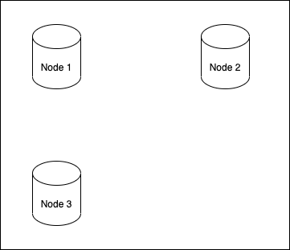
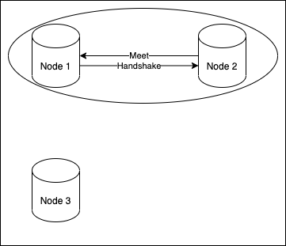
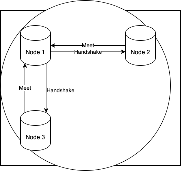
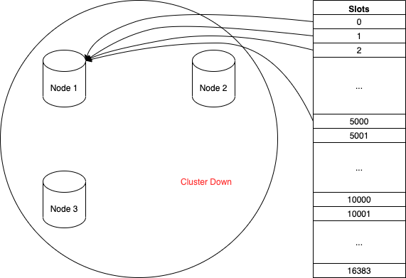
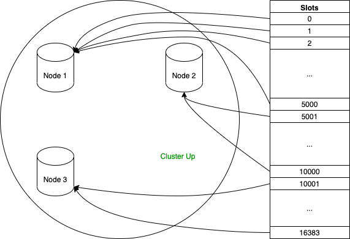
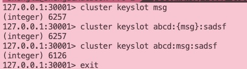

Redis集群中key的设计
===

# 小游戏
* 1号 黄色
* 2号 红色
* 3号 橙色
* 4号 绿色
* 5号 棕色

# 一句话概括redis是什么

基于内存作为存储的键值对（key-value）数据库，常用于设计缓存，也因其基于内存设计的特性，可做为加速数据访问的有效工具。

## 一些redis的数据类型

* string
* hash
* list
* zset
* ...

## redis相应的数据类型命令

* Set, Get ...
* HSet, HGet, HDel ...
* LPUSH, LPOP ...
* ZADD, ZREM ...
# redis集群模式

## 集群是怎么来的

集群是由一些redis节点（node）组合构成的。（redis于3.0版本后开始支持cluster模式）

**Cluster Meet**





同时，集群共同管理16384个槽（slot），redis数据库中每个key都属于这16384个slot中的一个。集群中的每个redis node都能够处理最少0到最多16384个slot。
当每个slot都被node认领时，整个集群的状态处于上线状态；相反的，只要有任意slot未被node认领，整个集群都处于下线状态。

**Cluster Addslots**



为什么是16384个slot？https://github.com/redis/redis/issues/2576

## 计算key属于哪个槽

**Cluster Keyslot**
redis hashtag magic


## 重新分片 （resharding）
在新的node加入集群后，将已经被其他node持有的slots重新分配给新的node，这个过程叫做重新分片。此过程由redis-trib这个集群管理软件完成。

## 实际问题


### 原quiz redis key设计

```
{QJCHM3J}:quiz:answered_total zset, 230W 个 item, 预估占用内存 210MB
{QJCHM3J}:quiz:answered hash, 230W 个 item, 预估占用内存 2 GB

zset key
{QJCHM3J}:quiz:answered_total
user_id1 -- 100
user_id2 -- 101
...

hash key
{QJCHM3J}:quiz:answered
user_id1 -- quiz_id1,quiz_id2,quiz_id3...
user_id2 -- quiz_id3,quiz_id5,quiz_id8...
...
```

### 看完上面的这些知识点，现在给两个场景，思考一下怎样以正确的姿势使用redis集群？

1. 每个用户的每个消费动作都能产生一个transaction，transaction里面记录了消费产生的货币消耗，消费时间等信息。如何通过redis设计key来保存这些transaction？
2. 这个app的游戏世界中，稀有装备的掉落（产生），都有不同的个体差异，例如两个玩家都获得了稀有大宝剑，玩家1的大宝剑有独特的吸血属性，玩家2的大宝剑有独特的眩晕效果。如何通过redis设计key来保存这些掉落的大宝剑？