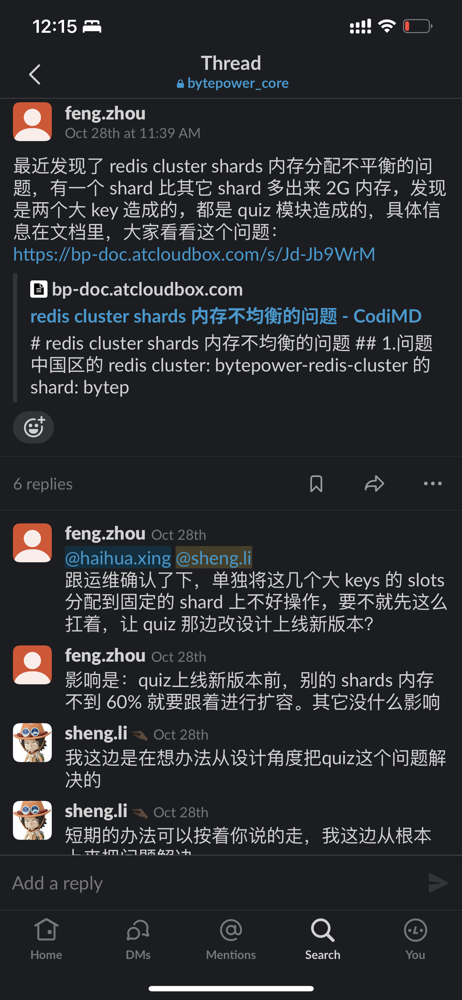

Understanding Hash Table application in Redis(cluster) / 哈希表在redis（集群）中的一些应用
===

# 一句话概括redis是什么

基于内存作为存储的键值对（key-value）数据库，常用于设计缓存，也因其基于内存设计的特性，可做为加速数据访问的有效工具。

## 一些redis的数据类型

* string
* hash
* list
* ...

## redis数据类型的基本设计单元

* SDS （simple dynamic string）
* Dictht （dictionary hash table）
* ListNode
* ...

# redis中的dictht

其不仅用于redis中hash系列命令（诸如HSet，HGet，HLen。。。）的实现，也参与在redis内部系统的构建之中。

## 如果让你写一个hash table的实现，你怎么写？（关注的重点有哪些）

* <span style="color:black">哈希的计算</span>
* <span style="color:black">冲突的解决</span>
* <span style="color:black">扩容与缩容（rehash）</span>

## redis是如何设计的

```c
typedef struct dict{
    dictType *type;
    void *privdata;

    //哈希表
    dictht ht[2];

    //rehash索引
    int rehashidx;
} dict;

typedef struct dictht{
    //哈希表数组
    dictEntry **table;

    //哈希表大小
    unsigned long size;

    //哈希表大小掩码
    unsigned long sizemask;

    //这个表已有数量
    unsigned long used;
} dictht;

typedef struct dictEntry{
    //键
    void *key;

    //值
    union{
        void *val;
        int64_t s64;
        uint64_t u64;
    } v;

    struct dictEntry *next;
} dictEntry;
```
> redis使用的是CRC16哈希算法

## 思考：如果哈希表的大小被固定了，会发生什么？

* <span style="color:black">任何key在哈希表里的位置也都固定，不会因为rehash而改变。</span>

# redis cluster
## quiz问题



## 集群中的slots

## crc16 & 16384
why 16384？ https://github.com/redis/redis/issues/2576
